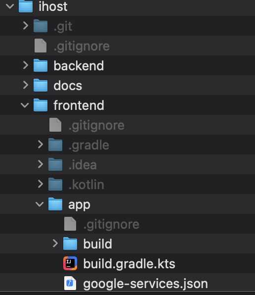
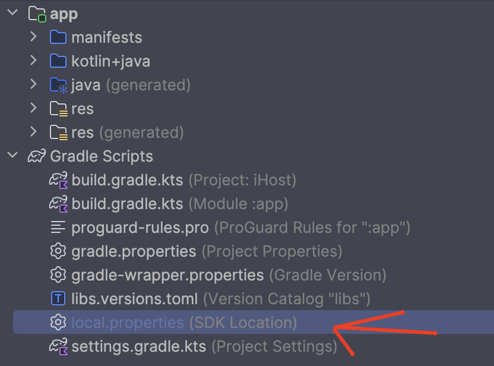
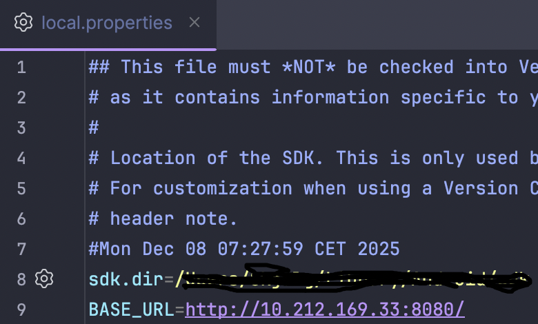
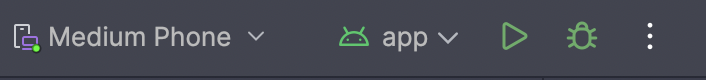

# iHost

An Android application for organizing and managing social events with friends. Create events, invite friends, share details, and coordinate gatherings all in one place.


## How to deploy and test iHost
1. Create a local directory and clone the repository.
```
mkdir iHost
cd iHost
git clone https://git.gvk.idi.ntnu.no/course/prog2007/prog2007-2025-workspace/ervin/ihost.git
```
2. Open the paste.iik.ntnu link found under our repository link in our Inspera delivery. (Encrypted and paassword protected, password is with the link in Inspera)
3. Download the google-services.json file from the paste.iik.ntnu link and place it under the frontend/app/ directory in the iHost directory as seen below:
 <br>
If theres any issues with getting the json file, contact skjalgct@stud.ntnu.no.
4. Download Android Studios from https://developer.android.com/studio
5. Open the FRONTEND folder in Android Studios and let the gradle project sync.
6. Open the local.properties under Gradle Scripts

7. Enter BASE_URL=http://10.212.169.33:8080/ in local.properties like seen below:

8. Select Device Manager on the right hand side, click "+", select "Create a Virtual Device", select f.ex "Medium Phone".
9. Select the Device and run "app" to start iHost. <br>



#### Please note: You MUST be on a NTNU Network or connected to NTNU VPN for the app to work.

## Features

- 🎉 **Event Management** - Create, edit, and delete events with details (title, description, date, time, location)
- 🔗 **Share Events** - Generate unique share codes (e.g., `IH-A3K9L`) to invite friends
- 👥 **Friend System** - Add friends, manage friend requests, and invite them to events
- 📸 **Image Upload** - Add event images with automatic optimization (70-80% size reduction)
- ✅ **Invitation Management** - Accept, decline, or respond to event invitations
- 🔒 **Secure Authentication** - Firebase-powered JWT authentication with encrypted passwords
- 🗺️ **Location Support** - Add and view event locations with Google Maps integration

## Technology Stack

### Frontend (Android)
- **Kotlin 2.0.21** with **Jetpack Compose**
- **Material 3** - Modern Material Design components
- **MVVM Architecture** - ViewModel + StateFlow for reactive UI
- **Retrofit 2** + **OkHttp** - Type-safe HTTP client with automatic token injection
- **Coil 3** - Async image loading for Compose
- **Firebase Auth SDK** - Client-side authentication
- **Google Maps Compose** - Location features
- **Navigation Compose** - Type-safe navigation
- **Min SDK 26** (Android 8.0) | **Target SDK 36**

### Backend
- **Kotlin 1.9.25** with **Spring Boot 3.5.6**
- **Firebase Firestore** - NoSQL document database
- **Firebase Authentication** - Secure user authentication with JWT tokens
- **Cloudinary** - Cloud-based image storage with automatic optimization
- **Gradle with Kotlin DSL** - Build management
- **MockK** - Kotlin-first testing framework

## Frontend Structure

```
frontend/
└── app/
    └── src/
        └── main/
            └── java/no/ntnu/prog2007/ihost/
                ├── data/
                │   ├── model/
                │   │   ├── domain/      # Domain models
                │   │   └── dto/          # Data Transfer Objects
                │   ├── remote/
                │   │   ├── api/          # Retrofit API interfaces
                │   │   └── config/       # Network configuration
                │   └── repository/       # Data repositories
                ├── ui/
                │   ├── components/
                │   │   ├── auth/         # Auth-related components
                │   │   ├── events/       # Event-related components
                │   │   ├── layout/       # Layout components
                │   │   ├── splash/       # Splash screen components
                │   │   └── states/       # State management components
                │   ├── navigation/
                │   │   ├── config/       # Navigation configuration
                │   │   ├── graph/        # Navigation graphs
                │   │   └── state/        # Navigation state
                │   ├── screens/
                │   │   ├── addevent/     # Add event screen
                │   │   ├── auth/         # Authentication screens
                │   │   │   ├── forgotpassword/
                │   │   │   ├── login/
                │   │   │   ├── personalinfo/
                │   │   │   ├── signup/
                │   │   │   └── welcome/
                │   │   ├── events/       # Event screens
                │   │   │   ├── editevent/
                │   │   │   ├── eventdetail/
                │   │   │   ├── inviteusers/
                │   │   │   └── main/
                │   │   └── profile/      # Profile screens
                │   │       ├── addfriend/
                │   │       ├── friendslist/
                │   │       └── main/
                │   └── theme/            # Material 3 theme
                ├── viewmodel/            # ViewModels
                └── MainActivity.kt       # Entry point
```

## Backend Structure

```
backend/
└── src/
    └── main/
        └── kotlin/no/ntnu/prog2007/ihostapi/
            ├── config/           # Firebase and Spring Security configuration
            ├── controller/       # REST API endpoints
            ├── exception/        # Custom exceptions and error handling
            ├── model/
            │   ├── dto/          # Data Transfer Objects
            │   └── entity/       # Domain entities
            ├── repository/       # Data access layer
            ├── security/
            │   └── filter/       # Authentication filters
            └── service/
                └── impl/         # Service implementations
```

## Firestore Database Structure

The application uses 5 main collections in Firebase Firestore:

### 1. `users` Collection

Stores user information. Document ID is used as `uid`.

```
users/
  └── {uid} (document ID)
      ├── email: String
      ├── username: String (4-12 characters)
      ├── firstName: String
      ├── lastName: String? (optional)
      ├── photoUrl: String? (Cloudinary URL)
      ├── createdAt: String (ISO-8601)
      └── updatedAt: String? (ISO-8601)
```

**Example:**
```json
{
  "email": "ola.nordmann@example.com",
  "username": "olanord",
  "firstName": "Ola",
  "lastName": "Nordmann",
  "photoUrl": "https://res.cloudinary.com/.../profile.jpg",
  "createdAt": "2024-01-15T10:30:00",
  "updatedAt": "2024-03-20T14:45:00"
}
```

---

### 2. `events` Collection

Stores events created by users. Document ID is used as event ID.

```
events/
  └── {eventId} (document ID)
      ├── title: String
      ├── description: String?
      ├── eventDate: String (YYYY-MM-DD)
      ├── eventTime: String? (HH:mm)
      ├── location: String?
      ├── creatorUid: String (ref to users/{uid})
      ├── shareCode: String (unique share code)
      ├── createdAt: String (ISO-8601)
      └── updatedAt: String? (ISO-8601)
```

**Example:**
```json
{
  "title": "Sommerfest 2024",
  "description": "Grillkos i hagen",
  "eventDate": "2024-06-15",
  "eventTime": "18:00",
  "location": "Hjemme hos meg",
  "creatorUid": "abc123xyz",
  "shareCode": "SUMMER2024",
  "createdAt": "2024-01-20T09:00:00",
  "updatedAt": "2024-02-10T12:30:00"
}
```

---

### 3. `event_users` Collection

Junction table that connects users to events with status and role.

```
event_users/
  └── {Id} (document ID)
      ├── eventId: String (ref to events/{eventId})
      ├── userId: String (ref to users/{uid})
      ├── status: String (PENDING | ACCEPTED | DECLINED | CREATOR)
      ├── role: String (CREATOR | ATTENDEE)
      ├── invitedAt: String (ISO-8601)
      └── respondedAt: String? (ISO-8601)
```

**Statuses:**
- `PENDING` - Invited but not yet responded
- `ACCEPTED` - Accepted invitation
- `DECLINED` - Declined invitation
- `CREATOR` - Created the event

**Roles:**
- `CREATOR` - Event creator/host
- `ATTENDEE` - Regular attendee

**Example:**
```json
{
  "eventId": "event123",
  "userId": "user456",
  "status": "ACCEPTED",
  "role": "ATTENDEE",
  "invitedAt": "2024-02-01T10:00:00",
  "respondedAt": "2024-02-02T14:30:00"
}
```

---

### 4. `friendships` Collection

Stores friendship relationships and friend requests between users.

```
friendships/
  └── {friendshipId} (document ID)
      ├── user1Id: String (ref to users/{uid})
      ├── user2Id: String (ref to users/{uid})
      ├── status: String (PENDING | ACCEPTED | DECLINED)
      ├── requestedBy: String (ref to users/{uid})
      ├── requestedAt: String? (ISO-8601)
      └── respondedAt: String? (ISO-8601)
```

**Statuses:**
- `PENDING` - Friend request sent, waiting for response
- `ACCEPTED` - Friend request accepted
- `DECLINED` - Friend request declined

**Example:**
```json
{
  "user1Id": "user123",
  "user2Id": "user456",
  "status": "ACCEPTED",
  "requestedBy": "user123",
  "requestedAt": "2024-01-10T08:00:00",
  "respondedAt": "2024-01-11T10:30:00"
}
```

---

### 5. `event_images` Collection

Stores metadata for images associated with events. The actual images are stored in Cloudinary.

```
event_images/
  └── {imageId} (document ID)
      ├── path: String (Cloudinary URL)
      ├── eventId: String (ref to events/{eventId})
      └── createdAt: String (ISO-8601)
```

**Example:**
```json
{
  "path": "https://res.cloudinary.com/.../event_photo.jpg",
  "eventId": "event123",
  "createdAt": "2024-02-05T16:20:00"
}
```

## Architecture

### Frontend Architecture (MVVM)

```
┌─────────────────────────────────────────────┐
│  UI Layer (Jetpack Compose)                │
│  - Screens & Components                    │
│  - Observes StateFlow                      │
└──────────────────┬──────────────────────────┘
                   │
┌──────────────────▼──────────────────────────┐
│  ViewModel Layer                            │
│  - Business Logic                           │
│  - State Management (StateFlow)             │
│  - Lifecycle-aware (viewModelScope)         │
└──────────────────┬──────────────────────────┘
                   │
┌──────────────────▼──────────────────────────┐
│  Repository Layer                           │
│  - Data Access Abstraction                  │
│  - Kotlin Result for error handling         │
└──────────────────┬──────────────────────────┘
                   │
┌──────────────────▼──────────────────────────┐
│  Remote Data Source (Retrofit)              │
│  - REST API calls                           │
│  - FirebaseAuthInterceptor (auto tokens)    │
└──────────────────┬──────────────────────────┘
                   │
              Backend API
```

### Backend Architecture (Layered)

```
┌─────────────────────────────────────────────┐
│  Controller Layer (@RestController)         │
│  - HTTP Request Handling                    │
│  - Input Validation                         │
└──────────────────┬──────────────────────────┘
                   │
┌──────────────────▼──────────────────────────┐
│  Security Filter (FirebaseTokenFilter)      │
│  - JWT Token Validation                     │
│  - Spring Security Context Setup            │
└──────────────────┬──────────────────────────┘
                   │
┌──────────────────▼──────────────────────────┐
│  Service Layer (@Service)                   │
│  - Business Logic                           │
│  - Authorization Checks                     │
│  - Transaction Coordination                 │
└──────────────────┬──────────────────────────┘
                   │
┌──────────────────▼──────────────────────────┐
│  Repository Layer (@Repository)             │
│  - Firestore Data Access                    │
│  - CRUD Operations                          │
└──────────────────┬──────────────────────────┘
                   │
              Firebase Firestore
```

### Authentication Flow

```
1. User logs in → Firebase Auth (frontend)
2. Firebase generates JWT token
3. Token stored in memory (Firebase SDK)
4. User makes API call
5. OkHttp Interceptor → adds "Authorization: Bearer <token>"
6. Backend receives request
7. FirebaseTokenFilter → validates token with Firebase
8. Spring Security context set with user UID
9. Request proceeds to controller
10. Service layer checks authorization (e.g., only creator can edit event)
```

## Setup Instructions

### Prerequisites

- **Java 21** (for backend)
- **Android Studio** (latest version)
- **Firebase Project** with Firestore and Authentication enabled
- **Cloudinary Account** (free tier works)

### Backend Setup

1. **Clone the repository:**
   ```bash
   git clone <repository-url>
   cd ihost/backend
   ```

2. **Create Firebase service account key:**
   - Go to Firebase Console → Project Settings → Service Accounts
   - Click "Generate New Private Key"
   - Save as `serviceAccountKey.json` in `backend/src/main/resources/`

3. **Configure Cloudinary:**
   - Create `application.properties` in `backend/src/main/resources/`:
   ```properties
   cloudinary.cloud-name=your_cloud_name
   cloudinary.api-key=your_api_key
   cloudinary.api-secret=your_api_secret
   ```

4. **Build and run:**
   ```bash
   ./gradlew bootRun
   ```
   Backend will run on `http://localhost:8080`

### Frontend Setup

1. **Navigate to frontend:**
   ```bash
   cd ihost/frontend
   ```

2. **Add Firebase configuration:**
   - Download `google-services.json` from Firebase Console
   - Place in `app/` directory

3. **Create `local.properties`:**
   ```properties
   # Android SDK path (auto-generated by Android Studio)
   sdk.dir=/path/to/Android/sdk

   # Backend URL
   BASE_URL=http://10.0.2.2:8080/

   # Google Maps API Key (optional)
   GOOGLE_MAPS_API_KEY=your_maps_api_key
   ```

4. **Sync and build:**
   - Open project in Android Studio
   - Sync Gradle
   - Run on emulator or physical device

## API Endpoints

### Authentication
- `POST /api/users/register` - Register new user (public)
- `GET /api/users/username-available/{username}` - Check username availability (public)
- `GET /api/users/email-available/{email}` - Check email availability (public)

### Users
- `GET /api/users/me` - Get current user profile
- `PUT /api/users/me` - Update current user profile
- `GET /api/users/{uid}` - Get user by UID
- `GET /api/users/search` - Search users by username

### Events
- `GET /api/events` - Get all events for authenticated user
- `POST /api/events` - Create new event
- `GET /api/events/{eventId}` - Get event details
- `PUT /api/events/{eventId}` - Update event (creator only)
- `DELETE /api/events/{eventId}` - Delete event (creator only)
- `GET /api/events/code/{shareCode}` - Find event by share code

### Event Users (Invitations)
- `GET /api/event-users/{eventId}/attendees` - Get event attendees
- `POST /api/event-users/invite` - Invite users to event
- `PUT /api/event-users/{eventUserId}/accept` - Accept invitation
- `PUT /api/event-users/{eventUserId}/decline` - Decline invitation

### Friendships
- `GET /api/friendships` - Get all friendships for user
- `POST /api/friendships/request` - Send friend request
- `PUT /api/friendships/{friendshipId}/accept` - Accept friend request
- `PUT /api/friendships/{friendshipId}/decline` - Decline friend request
- `DELETE /api/friendships/{friendshipId}` - Remove friendship

### Images
- `POST /api/images/upload/event/{eventId}` - Upload event image
- `GET /api/images/event/{eventId}` - Get event images
- `DELETE /api/images/{imageId}` - Delete image

## Key Technical Implementations

### 1. Firebase JWT Authentication (Backend)
**File:** `backend/src/main/kotlin/no/ntnu/prog2007/ihostapi/security/filter/FirebaseTokenFilter.kt`

Custom Spring Security filter that:
- Intercepts every HTTP request
- Extracts JWT token from `Authorization: Bearer <token>` header
- Validates token with Firebase Admin SDK
- Sets Spring Security context with authenticated user UID
- Implements stateless authentication (no server-side sessions)

### 2. Automatic Token Injection (Frontend)
**File:** `frontend/app/src/main/java/no/ntnu/prog2007/ihost/data/remote/RetrofitClient.kt`

OkHttp interceptor that:
- Automatically fetches Firebase ID token for current user
- Injects token into Authorization header for every API request
- Uses `runBlocking` with coroutines for async token retrieval
- Eliminates manual token management across 50+ API calls

### 3. Image Optimization
**File:** `backend/src/main/kotlin/no/ntnu/prog2007/ihostapi/service/impl/CloudinaryServiceImpl.kt`

Cloudinary integration with automatic optimization:
```kotlin
"width", 1920,              // Max width 1920px
"height", 1080,             // Max height 1080px
"crop", "limit",            // Only resize if larger
"quality", "auto:good",     // Auto quality (AI-powered)
"fetch_format", "auto"      // WebP when supported
```
**Result:** 70-80% file size reduction (5-10MB → 500KB-1MB)

### 4. Reactive State Management
**File:** `frontend/app/src/main/java/no/ntnu/prog2007/ihost/viewmodel/EventViewModel.kt`

MVVM with StateFlow:
- UI state in `StateFlow<EventUiState>` (single source of truth)
- Atomic updates with `_uiState.update { }`
- Lifecycle-aware coroutines (`viewModelScope.launch`)
- Survives configuration changes (screen rotation)
- Automatic UI recomposition when state changes

### 5. Share Code Generation
**File:** `backend/src/main/kotlin/no/ntnu/prog2007/ihostapi/service/impl/EventServiceImpl.kt:200-208`

Generates unique event share codes (format: `IH-XXXXX`):
- 5 random alphanumeric characters
- Prefix "IH" for iHost branding
- Used for easy event discovery without exposing event IDs

## Testing

### Backend Tests

**Location:** `backend/src/test/kotlin/no/ntnu/prog2007/ihostapi/`

```bash
cd backend
./gradlew test
```

**Test files:**
- `IHostApiApplicationTests.kt` - Spring Boot context loading test
- `service/impl/EventServiceImplTest.kt` - Event service unit tests
- `service/impl/UserServiceImplTest.kt` - User service unit tests
- `service/impl/EventUserServiceImplTest.kt` - Event-user relationship tests
- `service/impl/FriendshipServiceImplTest.kt` - Friendship service tests

**Key test coverage:**
- **EventServiceImpl**: Share code generation (format `IH-XXXXX`), event creation with CREATOR status, authorization checks (only creator can update/delete), partial updates, event lookup by share code
- **UserServiceImpl**: Username validation (4-12 characters, uniqueness), email availability checks, boundary testing
- **EventUserServiceImpl**: Invitation workflows, status transitions (PENDING → ACCEPTED/DECLINED)
- **FriendshipServiceImpl**: Friend request creation, accept/decline logic, friendship deletion

**Testing tools:**
- **MockK** for mocking Firestore repositories
- **JUnit 5** with `@Nested` and `@DisplayName` for organized test structure
- **AAA Pattern** (Arrange, Act, Assert) for test clarity

### Frontend Tests

**Location:** `frontend/app/src/androidTest/` (instrumented tests), `frontend/app/src/test/` (unit tests)

```bash
cd frontend
./gradlew test                    # Unit tests (local JVM)
./gradlew connectedAndroidTest    # Instrumented tests (requires Android emulator/device)
./gradlew check                   # Run all tests
```

**Test files:**
- `ExampleUnitTest.kt` - Basic unit test example
- `ui/screens/auth/login/LoginScreenTest.kt` - Login screen instrumented UI tests (10 tests)
- `ui/screens/auth/signup/SignUpScreenTest.kt` - Sign-up screen instrumented UI tests (11 tests)
- `ui/screens/addevent/AddEventScreenTest.kt` - Add event screen instrumented UI tests (9 tests)
- `ui/screens/profile/main/ProfileScreenTest.kt` - Profile screen instrumented UI tests (17 tests)

**Key test coverage:**
- **LoginScreen**: Button enable/disable validation, email/password input, ViewModel `signIn()` calls, navigation callbacks
- **SignUpScreen**: Password matching validation, form field validation, loading states with disabled fields, error messages
- **AddEventScreen**: Create button logic (title required), form validation, optional fields handling, ViewModel `createEvent()` calls
- **ProfileScreen**: Login states, profile loading, user info display (name, username, email), event statistics, edit dialogs (name, avatar), friends section, navigation flows

**Testing tools:**
- **Jetpack Compose Testing** with `createComposeRule()` for instrumented tests
- **MockK** for mocking ViewModels and Firebase
- **Semantic testing** using `onNodeWithTag()` and `onNodeWithText()`
- **MutableStateFlow** for fake UI state management
- **AAA Pattern** for test structure

## Security Features

- ✅ **Password Encryption** - Firebase Authentication (bcrypt hashing)
- ✅ **JWT Token Validation** - Every API request validated
- ✅ **HTTPS/TLS** - All communication encrypted
- ✅ **Authorization Checks** - Users can only modify their own content
- ✅ **Input Validation** - Spring Boot `@Valid` annotations
- ✅ **CORS Configuration** - Controlled cross-origin access
- ✅ **No SQL Injection** - Firestore NoSQL (parameterized queries)

## Future Improvements

- [ ] Push notifications for event updates and invitations
- [ ] Cascade deletion for GDPR compliance (delete all user data on account deletion)
- [ ] Content moderation for event descriptions and images
- [ ] Rate limiting to prevent spam
- [ ] Block/report user functionality
- [ ] Event privacy levels (Private, Friends-only, Public)
- [ ] Calendar integration (export to Google Calendar)
- [ ] Offline mode with local database caching
- [ ] Multi-language support (i18n)
- [ ] Dark mode theme

## PROG2007 - Mobile Programming

Project developed as part of **PROG2007 - Mobile Programming** at **NTNU** (Norwegian University of Science and Technology).